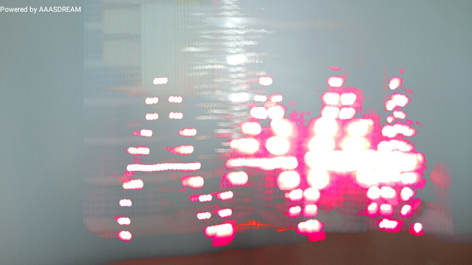
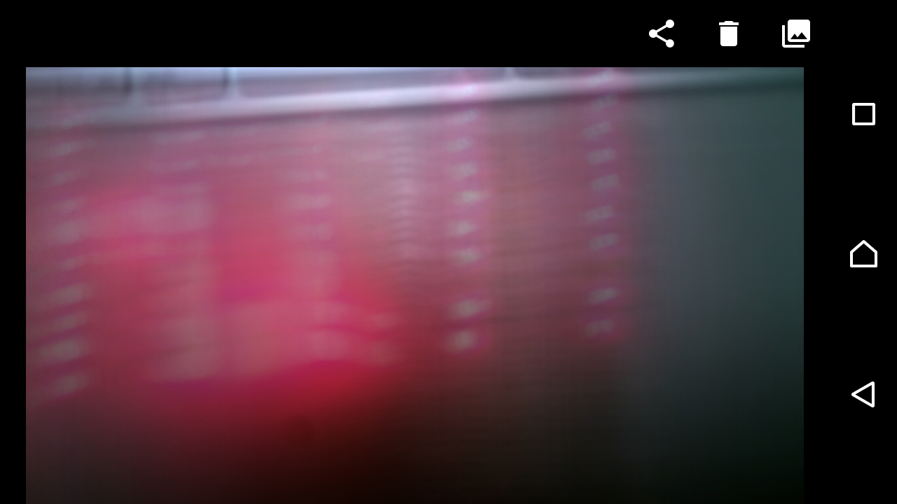

# 3.3 POV

## 1.演習の目的

POV を作成する．

## 2.問題解決の方針
ledの点滅を操作し，残像現象を用いてPOVを作成する．

## 3.プログラム

```Arduino
int ledarray[10];
//表示するPOVを以下に定義
int picsize = 35;
char* picture[] = {
"1111111111",
"1111111111",
"0000110000",
"0000110000",
"1111111111",
"1111111111",
"0000000000",
"1110000011",
"1110000011",
"1111111111",
"1111111111",
"1110000011",
"1110000011",
"0000000000",
"0000000000",
"0000000000",
"1111111011",
"1111111011",
"0000000000",
"0000000000",
"0000000000",
"0000000000",
"0000000000",
"1111111011",
"1111111011",
"0000000000",
"0000000000",
"0000000000",
"0000000000",
"0000000000",
"0000000000",
"0000000000",
"0000000000",
"0000000000",
"0000000000",
};


void setup(){
  for(int i=0; i<10;i++){
    ledarray[i] = i+2;
    pinMode(ledarray[i], OUTPUT);
  }
Serial.begin(9600);
}

void loop(){
  for(int i=0; i < picsize; i++){
    display(picture[i]);
  }
}

void display(char* pic){
  int digits[picsize];
  for(int i = 0; i <10; i++){
   digits[i] = pic[i]-'0';
   Serial.print(digits[i]);
  }

  for(int i = 0; i <10; i++){
   if(digits[i]==0){
    digitalWrite(ledarray[i],LOW);
   }else if(digits[i]==1){
    digitalWrite(ledarray[i],HIGH);
   }
  }

  delay(5);
}
```


## 4.実行結果

2つのPOVを作成し，撮影した結果を以下に示す．
### 1. Aの文字が見える<br>

### 2. HI!!の文字が見える<br>



## 5.考察
表示する工夫として，display()関数を作成した．

```Arduino
int picsize = 35;
char* picture[] = {
"1111111111",
....  //省略
"1111111111",
}

void display(char* pic){
  int digits[picsize];
  for(int i = 0; i <10; i++){
   digits[i] = pic[i]-'0';
   Serial.print(digits[i]);
  }
```
上記のコードが示すように，Stringがcharの配列であることを用いて，できるだけ簡単にどのledをつければよいのかを指定した．

## 6.参考文献

「情報科学基礎実験!第2章Arduinoを用いた基礎的な実験」テキスト

## 7.謝辞

この実験をレポートとして形にすることが出来たのは、ペアの杉崎さん、TAの皆様に協力していただいたおかげです｡ 協力していただいた皆様へ心から感謝の気持ちと御礼を申し上げたく、謝辞にかえさせていただきます｡
